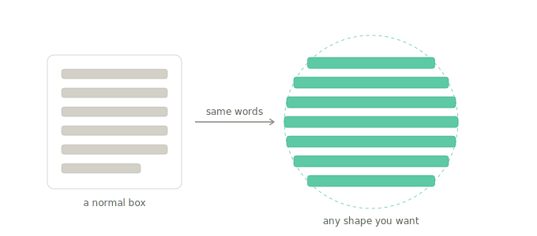

# What is this, in plain words

## The gist

A small, reusable engine (a "kernel") that pours text into arbitrary shapes — circles, polygons,
logos, shapes with holes — instead of only rectangles. It's built on
[Cheng Lou's Pretext](https://github.com/chenglou/pretext) and is render-agnostic: it works out the
geometry, and separate adapters draw it (Canvas2D today, with hooks for fancier paint later).

> **Honest scope:** this is a hobby + learning project — also an exercise in shipping an npm package
> properly (semver, CI-on-tag). It stands *on top of* Pretext; it is not a replacement for it, nor
> production infrastructure. Pretext does the hard part; this just decides the shape.

## ELI5

Think of text like water. On the web, water only ever goes into a rectangular glass — every
paragraph is a box. We built a thing that lets you pour the same water into a circle, a heart, a
donut, anything.

The trick is simple once you see it: slice the shape into thin horizontal strips, and for each strip
ask "how wide is the shape right here?" Then you tell the text "this line only gets *this* much
room," fit as many words as fit, drop to the next strip, and repeat. Near the top of a circle the
strips are short, so the lines are short; in the middle they're long. That's why the words hug the
shape.

The secret helper is **Pretext**. Normally a browser figures out how text wraps by actually drawing
it and then measuring — which is slow, so you can't do it sixty times a second. Pretext is a
super-fast *ruler* that measures how text will wrap *without drawing it first*. Our engine is the
"pourer" that stands on top of that ruler: it asks the ruler about each strip and lays the words
down.

One bonus: because the engine always knows exactly which letters landed where, the same brain can
later run *backwards* — you click a spot and it tells you which letter you clicked. That's what a
text editor needs, so the pourer doubles as the foundation for a canvas text editor down the road.

## How we got here

It started as wanting to build something on Pretext, the text-measuring library that had just gone
viral, with a bias toward something genuinely novel rather than the obvious "masonry layout" stuff.
Four directions came up; the first useful correction was that Pretext is **client-side** (an early
idea had overreached into server-side), which sharpened the scope.

The decision was "a library," and to dig deep on two ideas: pouring text into shapes, and a canvas
text editor. Digging in surfaced the key realization — those two are **mirror images**. One turns a
letter-position into a pixel; the other turns a pixel into a letter-position. They both need the same
small core. That core became **the kernel**, and the whole project reorganized around it.

Next came Chrome's brand-new **HTML-in-Canvas** feature, which turned out to be the most interesting
twist: it's the philosophical *opposite* of Pretext — it leans *into* the browser's slow layout
engine, exactly what Pretext avoids. Instead of either/or, the answer was both: let Pretext **plan**
the layout cheaply every frame, and let HTML-in-Canvas **paint** it beautifully only when the layout
changes. The one thing neither library can do alone — shaped, real-CSS text wrapped onto a 3D
surface — became the dream flagship demo.

After weighing "best shot + worth building" honestly (novel and finishable, but a capability people
love *occasionally*, not infrastructure everyone installs), the call was to build it. So the kernel
got written, real Pretext got wired in (and we found the published npm package lags its own README),
and 19 tests went green. Then it was packaged — working code plus design docs and a phased roadmap —
for a clean handover into Claude Code.

---

See `SPEC.md` for the design and `ROADMAP.md` for what's next.
